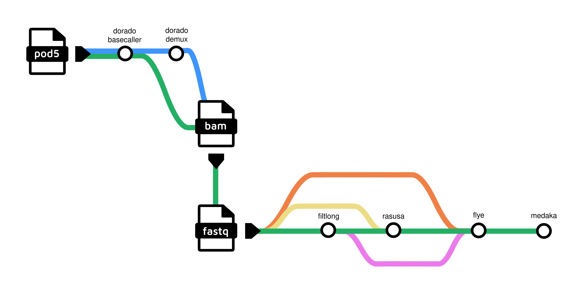

# LARRI - Long-reads Assembly Reconstruction and Refinement pIpeline


This pipeline provides a comprehensive workflow for assembling long reads, supporting input files in FASTQ, BAM, or POD5 formats. The focus is on bacterial genomes but the pipeline can be also used for other species (untested). 

⚠ Note: The pipeline processes only one input type at a time.

For POD5 files, it uses [**Dorado**](https://github.com/nanoporetech/dorado) to basecall.



In the subway-style diagram above, the green track represents the default workflow. The pipeline is modular, so alternative tracks can be followed by enabling or disabling steps through parameters (see `--help`). It is also possible to run the pipeline just for basecalling, without performing the assembly steps.

## How to Run

To run **LARRI**, you must specify **exactly one input type**:  
- a **BAM** file using the `--bam` option  
- a **FASTQ** file using the `--fastq` option  
- a **pod5** file or folder using the `--pod5` option  

### Usage Examples

**Attention:** We use release version 0.0.1 in these example commands but always check for the latest or matching release you want to run. You can use `nextflow info rki-mf1/LARRI` to screen available release versions.

Run with a single BAM file:

```bash
# check for the release you want to use! 
nextflow run rki-mf1/LARRI -r 0.0.1 --bam 'sample.bam'
```

Run with a single FASTQ file:

```bash
nextflow run rki-mf1/LARRI -r 0.0.1 --fastq 'sample.fastq.gz'
```

Run with multiple BAM or FASTQ files (using wildcard):

```bash
nextflow run rki-mf1/LARRI -r 0.0.1 --bam '*.bam'
nextflow run rki-mf1/LARRI -r 0.0.1 --fastq '*.fastq.gz'
```

Run with a single pod5 file or a folder:

```bash
nextflow run rki-mf1/LARRI -r 0.0.1 --pod5 'file.pod5'
nextflow run rki-mf1/LARRI -r 0.0.1 --pod5 '/path/to/folder/'
```

> **Important**:
> - Only one of the options `--bam`, `--fastq`, or `--pod5` can be provided at a time. 
> - Multiple input files can only be used with `--bam` and `--fastq` (via wildcards). Use single ticks! 
> - The `--pod5` option only supports a single file or a folder of files.  


## Running with Containers

Run using **Docker**:

```bash
nextflow run rki-mf1/LARRI -r 0.0.1 --bam 'sample.bam' -profile docker
```

Run with **SLURM** and **conda** (currently not supported, but coming soon):
```bash
nextflow run rki-mf1/LARRI -r 0.0.1 --bam 'sample.bam' -profile slurm,conda
```

Run with **SLURM** and **Singularity**:

```bash
nextflow run rki-mf1/LARRI -r 0.0.1 --bam 'sample.bam' -profile slurm,singularity
```

## Dorado Basecalling

If pod5 files are provided as input, the pipeline will use **Dorado** to basecall the data.  

To also run [Dorado demultiplexing](https://github.com/nanoporetech/dorado?tab=readme-ov-file#barcode-classification), pass the `--demux` parameter. In this case:  
- The Dorado basecaller will **not trim the barcodes**.  
- The Dorado demux command will run immediately after basecalling.  

Optionally, a **tsv sample sheet** (provided using the `--sample_sheet` option) can be used to specify which barcodes are of interest. The sample sheet is a simplified version of the one required by [Dorado](https://github.com/nanoporetech/dorado/blob/release-v1.1/documentation/SampleSheets.md) and has the following format:

| alias     | barcode   |
|-----------|-----------|
| species_1 | barcode13 |
| species_2 | barcode15 |
| species_3 | barcode16 |

Here, the `alias` column defines the user-selected sample names, which will be used by the pipeline to rename the barcodes. In the absence of a sample sheets, all barcodes will be assembled.

When the parameter `--modifications` is enabled (default: `false`), Dorado will also basecall modified bases, specifically **6mA**, **4mC**, and **5mC**.

The `--basecalling` parameter can be used to perform only the basecalling step, without proceeding to assembly.

## Assembly Workflow

The assembly workflow follows a modular structure with optional steps for read filtering, subsampling, assembly, and polishing. 

1. **Read Filtering (Filtlong)** *(optional)*
If `--run_filtlong` is enabled, input reads shorter than `--min_length_filtlong` are removed (default: **500 bp**). 

2. **Read Subsampling (Rasusa)** *(optional)*
If `--run_rasusa` is enabled, reads are subsampled to reach the target coverage specified by `--coverage_rasusa` (default: **100×**). The expected genome size can be provided via `--genome_size_mb` (default: **3.5 Mbp**).

4. **Assembly (Flye)** 
Reads are assembled using Flye. The genome size is also specified with `--genome_size_mb`.

5. **Polishing (Medaka)**
The model can be specified with `--medaka_model`. If `--bacteria_flag_medaka` is true, bacterial-specific settings are applied.

### Default Parameters

| Parameter                | Default Value       | Description                                                      |
|---------------------------|---------------------|------------------------------------------------------------------|
| `--run_filtlong`          | `true`              | Enable read filtering with Filtlong                              |
| `--min_length_filtlong`   | `500`               | Minimum read length to keep (bp)                                 |
| `--run_rasusa`            | `true`              | Enable read subsampling with Rasusa                              |
| `--coverage_rasusa`       | `100`               | Target coverage for subsampling                                  |
| `--genome_size_mb`        | `3.5`               | Expected genome size (Mb) for Flye                               |
| `--medaka_model`          |       | If not specified, the model is automatically inferred by Medaka (default: latest available model).                            |
| `--bacteria_flag_medaka`  | `true`              | Use bacterial-specific Medaka options                            |
